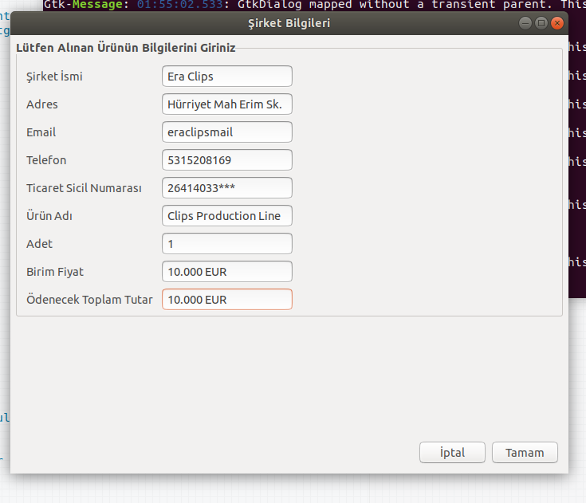
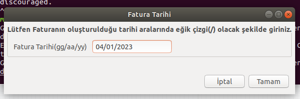
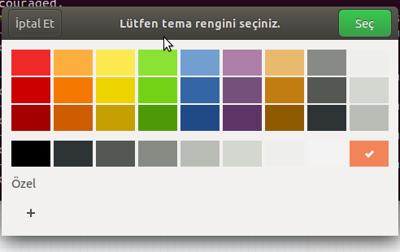

# bash-invoice-creator
Bursa Teknik Üniversitesi Bilgisayar Mühendisliği, 3. sınıf Linux Araçları ve Kabuk Programlama dersi projesi için hazırlanmıştır. Bash dili ve Zenity kütüphanesi kullanılarak kullanıcıdan alınan bilgilerle HTML formatında bir Fatura hazırlanmaktadır;

Zenity ve Bash kullanarak yaptığım fatura oluşturma uygulaması

# Bash ile Fatura yapma uygulaması
### Uygulamada fatura oluşturmak için scriptte kullanılan GUI elemanlarıyla html şeklinde bir fatura elde ediyoruz.

## Ekran Görüntüleri

Projemin tanıtım videosuna;
** https://youtu.be/Yxt07Yi6Uxg **
adresinden erişebilirsiniz.

Projeyi terminale "bash html-invoice.bash" yazarak çalıştırabilirsiniz.
